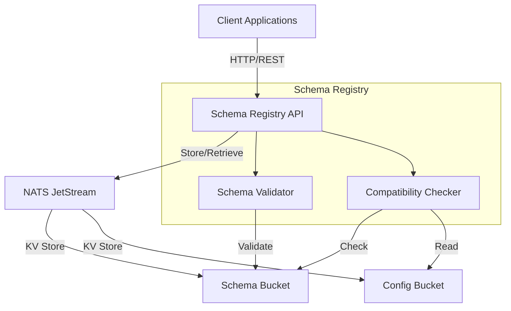

# Schema Registry

A schema registry implementation using NATS JetStream as the storage backend. This implementation follows the Confluent Schema Registry API specification and supports JSON Schema, Avro, and Protobuf formats.

## Features

- REST API compatible with Confluent Schema Registry
- NATS JetStream KV as storage backend
- Support for JSON Schema, Avro, and Protobuf
- Schema compatibility checking
- Global and subject-level compatibility settings
- Docker support for easy deployment
- Comprehensive test suite

## Architecture



The diagram above shows the main components of the Schema Registry:
- Client applications interact with the Schema Registry through a REST API
- The Schema Registry uses NATS JetStream as its storage backend
- Schemas are stored in a dedicated KV bucket
- Configuration settings are stored in a separate KV bucket
- Schema validation and compatibility checking are handled internally

## Prerequisites

- Go 1.21 or later
- NATS server with JetStream enabled
- Docker and Docker Compose (for containerized deployment)

## Installation

### From Source

```bash
go install schemaregistry/cmd/schemaregistry@latest
```

### Using Docker

```bash
docker-compose up -d
```

## Usage

### Running Locally

1. Start a NATS server with JetStream enabled:
```bash
nats-server -js
```

2. Run the schema registry:
```bash
schemaregistry
```

### Using Docker Compose

The project includes a `docker-compose.yml` file that sets up both the schema registry and NATS server:

```bash
docker-compose up -d
```

### Configuration

The schema registry can be configured using environment variables or command-line flags:

| Flag | Environment Variable | Default | Description |
|------|---------------------|---------|-------------|
| `--nats-url` | `NATS_URL` | `nats://localhost:4222` | NATS server URL |
| `--http-addr` | `HTTP_ADDR` | `:8081` | HTTP server address |
| `--schema-bucket` | `SCHEMA_BUCKET` | `SCHEMAS` | KV bucket for schemas |
| `--config-bucket` | `CONFIG_BUCKET` | `CONFIG` | KV bucket for configs |

### API Endpoints

The schema registry implements the following endpoints:

- `GET /subjects` - List all subjects
- `POST /subjects/{subject}/versions` - Register a new schema
- `GET /subjects/{subject}/versions` - List schema versions
- `GET /subjects/{subject}/versions/{version}` - Get a specific schema version
- `POST /compatibility/subjects/{subject}/versions/{version}` - Check schema compatibility
- `GET /config` - Get global compatibility settings
- `PUT /config` - Update global compatibility settings
- `GET /config/{subject}` - Get subject compatibility settings
- `PUT /config/{subject}` - Update subject compatibility settings

## Development

1. Clone the repository:
```bash
git clone https://github.com/yourusername/schemaregistry.git
cd schemaregistry
```

2. Install dependencies:
```bash
go mod download
```

3. Run tests:
```bash
make test
```

4. Build:
```bash
make build
```

### Makefile Commands

The project includes a Makefile with several useful commands:

- `make build` - Build the schema registry binary
- `make test` - Run all tests
- `make clean` - Clean build artifacts
- `make docker-build` - Build Docker images
- `make docker-push` - Push Docker images to registry
- `make lint` - Run linters
- `make fmt` - Format code

### Testing

The project includes a comprehensive test suite in the `tests` directory. To run the tests:

```bash
make test
```

## License

Apache License 2.0 